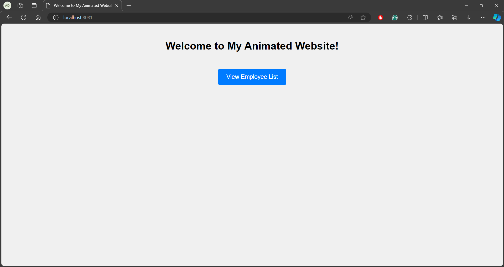
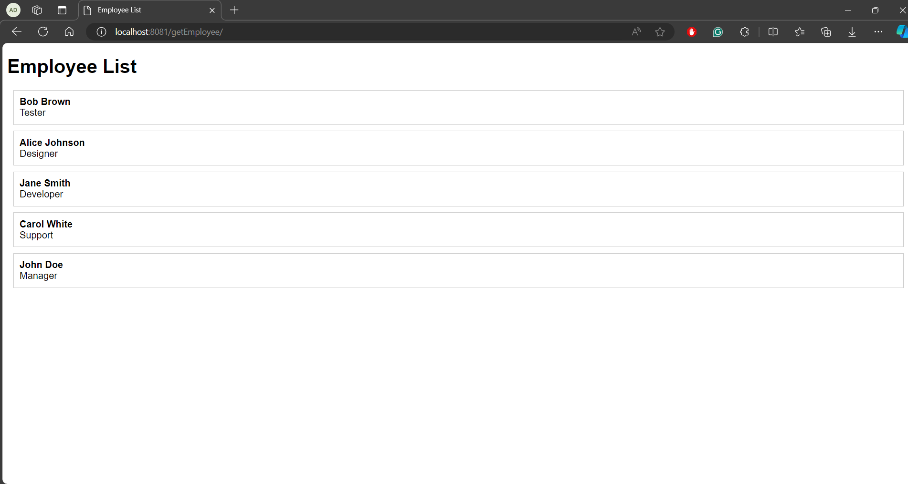
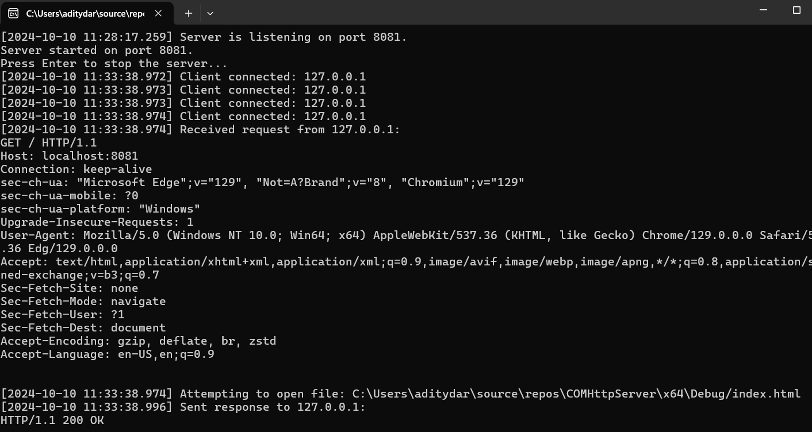

# 🌐 COMet Server

An efficient and modern Windows-based multithreaded HTTP server utilizing COM interfaces, serving an animated GUI website with dynamic content.

---

## 📂 Project Structure

- **HttpServer.cpp**: Core server implementation, handling client connections and request processing.
- **HttpServer.hpp**: Header file for `HttpServer.cpp` containing class declarations and function prototypes.
- **IHttpServer.hpp**: Interface definition for the `IHttpServer` COM interface.
- **main.cpp**: Entry point of the application, initializes the server and starts listening for connections.
- **index.html**: The animated GUI homepage served by the server.
- **COMHttpServer.sln**: Visual Studio solution file to open the project.
- **COMHttpServer.vcxproj**: Project configuration file for Visual Studio.

---

## 🚀 Key Features

|  |
|:----------------------------------------:|
| **Animated GUI Website**: Serves a modern, animated homepage with interactive elements. |

### 🌟 Highlights

- **Multithreaded Performance**: Handles multiple client connections simultaneously using multithreading.
- **COM Interface**: Utilizes COM for clean abstraction and modularity.
- **Dynamic Content**: Generates dynamic pages like a randomized employee list with animations.
- **Static File Serving**: Efficiently serves static assets including HTML, CSS, JavaScript, images, and more.
- **Detailed Logging**: Logs client connections, requests, and responses for easy monitoring.
- **Security Measures**: Implements checks to prevent unauthorized file access and directory traversal attacks.

---

## 🎨 Screenshots

|  |
|:----------------------------------------:|
| **Server Status**: Displays when the server is actively listening for incoming client connections confirming readiness to handle request Server listening on port 8081.. |
| **Client Connected**: Logs the connection of each client, showing their IP address to monitor client activity |

|  |
|:----------------------------------------:|
|  |
| **Client Request**: Captures and logs the details of HTTP requests made by clients, such as page requests or API calls|
[REQUEST] GET /index.html HTTP/1.1.

|  |
|:----------------------------------------:|
| **Server Response**: Logs the HTTP responses sent back to clients, indicating what content or data was provided in response to their requests|
[RESPONSE] HTTP/1.1 200

| **Error Log**: Records any errors encountered during operation, such as binding failures or connection issues, to assist in troubleshooting.
[ERROR] Bind failed with error: 10048

## 🛠️ Technologies Used

- 💻 **C++**: Core server logic and performance optimization.
- ⚙️ **COM (Component Object Model)**: For interface abstraction and reusability.
- 🌐 **WinSock2**: Network programming for handling HTTP requests and responses.
- 🧵 **Multithreading**: Ensures efficient handling of multiple simultaneous client connections.
- 🎨 **HTML/CSS/JavaScript**: Front-end technologies for the animated GUI website.
- 🔒 **Security Practices**: Prevents common web vulnerabilities.

### 📚 Useful Resources

- [Microsoft COM Guide](https://learn.microsoft.com/en-us/windows/win32/com/component-object-model--com--portal) - Official documentation for COM programming.
- [WinSock2 Programming](https://learn.microsoft.com/en-us/windows/win32/winsock/windows-sockets-start-page-2) - Guide to network programming with WinSock2.
- [C++ Multithreading](https://en.cppreference.com/w/cpp/thread) - Reference for C++ threading libraries and best practices.

---

## 🎯 How to Get Started

1. **🔗 Clone the Repository**:
   ```bash
   git clone https://github.com/your-username/COMet-Server.git
   ```

2. **📂 Open the Solution in Visual Studio**:
   - Navigate to the project directory.
   - Open `COMHttpServer.sln` in Visual Studio.

3. **🔧 Configure the Project**:
   - Ensure that `Ws2_32.lib` is linked:
     - Go to **Project Properties > Linker > Input > Additional Dependencies**.
     - Add `Ws2_32.lib` if it's not already listed.

4. **📄 Place `index.html` and Assets**:
   - Make sure `index.html` and any required static assets (CSS, JS, images) are located in the same directory as the executable (`Debug` or `Release` folder).

5. **▶️ Run the Server**:
   - Build the project by pressing **Ctrl + Shift + B** or selecting **Build > Build Solution**.
   - Start the server by pressing **F5** (Debug) or **Ctrl + F5** (Run Without Debugging).
   - The console should display:
     ```
     [YYYY-MM-DD HH:MM:SS.mmm] Server is listening on port 8081.
     ```

6. **🌐 Access the Website**:
   - Open a web browser.
   - Navigate to `http://localhost:8081/`.
   - Explore the animated GUI and dynamic content.

---

## 🤝 Contributing

Contributions are welcome! Here's how you can help:

1. **Fork the Repository**:
   - Click the "Fork" button at the top right of this page.

2. **Create a Feature Branch**:
   ```bash
   git checkout -b feature/your-feature-name
   ```

3. **Commit Your Changes**:
   ```bash
   git commit -am 'Add a new feature'
   ```

4. **Push to the Branch**:
   ```bash
   git push origin feature/your-feature-name
   ```

5. **Open a Pull Request**:
   - Navigate to your forked repository.
   - Click on the "New Pull Request" button.

---

## 📄 License

This project is licensed under the MIT License - see the [LICENSE](LICENSE) file for details.

---

## 📞 Contact

**Your Name**

- Email: your.email@example.com
- LinkedIn: [Your LinkedIn Profile](https://www.linkedin.com/in/yourprofile)
- GitHub: [your-username](https://github.com/your-username)
