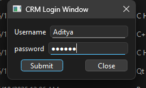
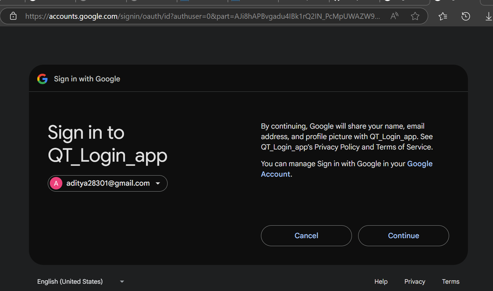
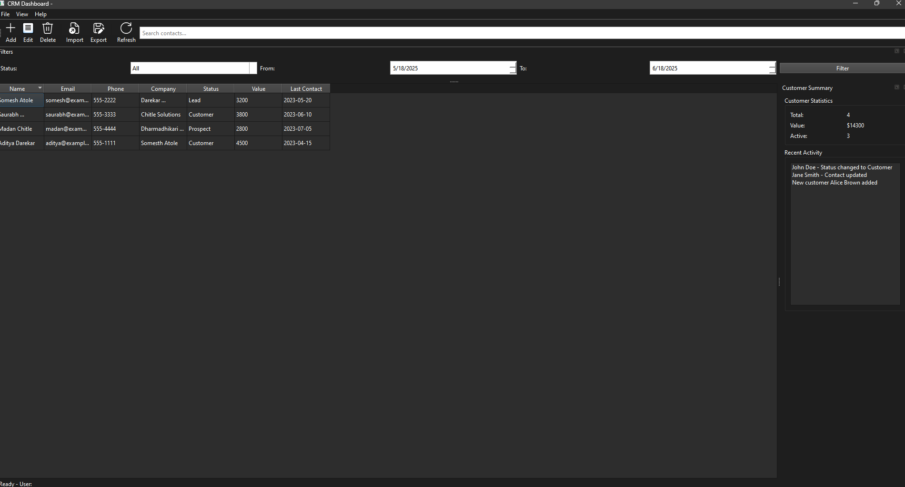

# 💼 SingleSignOn-CRM — A Qt Desktop App with Google Login

**SingleSignOn-CRM** is a native C++/Qt-based CRM desktop application with a visually appealing GUI and secure Google OAuth 2.0 login integration. Built for a seamless and animated user experience, it provides a structured codebase and a professional feel — ideal for learning, showcasing, or extending into a real-world CRM tool.

---

## ✨ Key Features

🔐 **Google OAuth 2.0 Login**  
Secure and standards-compliant login system using your Google account with local server redirect (`localhost:8080`).

🖼️ **Modern, Animated Qt GUI**  
Designed with `QStackedWidget`, `QPropertyAnimation`, and smooth transitions for a polished user interface.

📊 **Expandable CRM Dashboard**  
Includes a basic dashboard layout with user data sections, prepared for future modules like client/contact management.

🔌 **Modular Code Structure**  
Separated logic for networking, GUI handling, and OAuth communication — easy to read, extend, and test.

🌍 **Cross-Platform Native Build**  
Runs on Windows, Linux, and macOS using Qt 5.15+ or Qt 6, with full desktop-level performance.

---

## 🎥 GUI Overview

> _Screenshots and demo animations will be available soon (place images inside the `/images` folder)_

| Login Page | Google Auth | Dashboard |
|------------|-------------|-----------|
|  |  |  |

---

## 🧠 GUI Highlights

### 🔹 Login Page
- Clean, centered layout with animated transitions.
- Google Sign-In initiates via default browser.
- User feedback shown using live status messages.

### 🔹 OAuth Flow
- Embedded local server (`QTcpServer`) listens on port `8080` for receiving authorization code.
- Parses URL query and exchanges code for access token securely.

### 🔹 Dashboard (Post Login)
- Uses `QStackedWidget` to switch between login and dashboard screens.
- Animated slide-ins and fade transitions for panels.
- Placeholder sections for user data, activity logs, and client lists.

---

## 🛠️ How to Build

### Requirements
- Qt 5.15+ (or Qt 6)
- CMake (or use `qmake` for Qt Creator)
- OpenSSL (for HTTPS OAuth requests)

### CMake Build (Recommended)
```bash
mkdir build && cd build
cmake ..
make
./SingleSignOn-CRM
